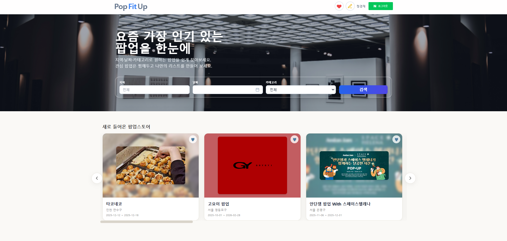
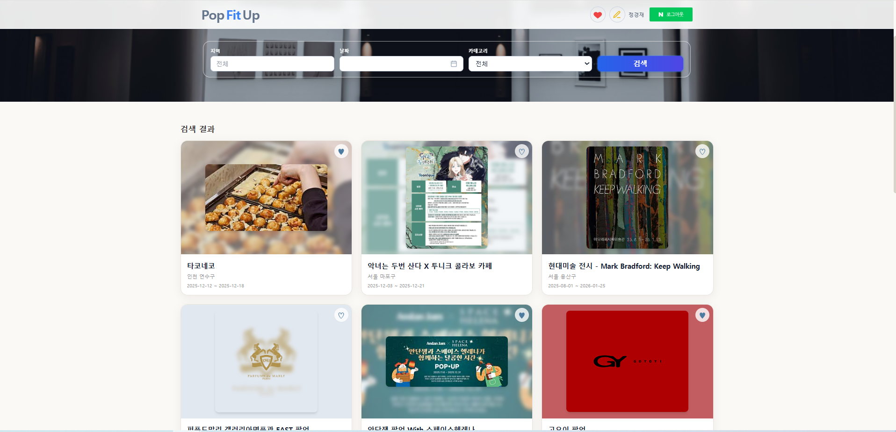
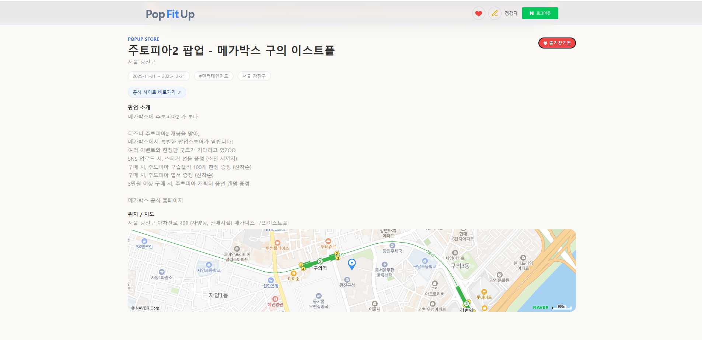
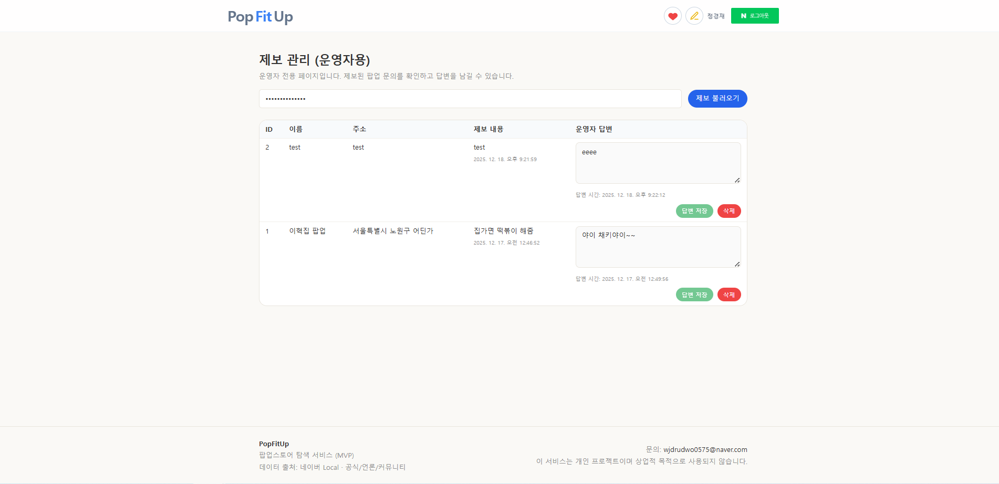
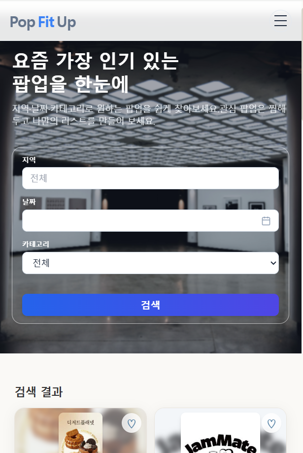

# 🛍️ PopFitUp Frontend

네이버 지도 기반 팝업스토어 탐색 서비스 **PopFitUp**의 프론트엔드 프로젝트입니다.

사용자는 지역, 날짜, 카테고리 기준으로 팝업스토어를 검색하고, 상세 페이지에서 위치 정보와 관련 팝업을 확인할 수 있습니다.

이 프로젝트에서는 지도 마커와 카드 리스트를 연결하고, 크롤링 데이터가 일부 누락되어도 화면이 깨지지 않도록 처리하는 데 신경 썼습니다.

---

## 🧰 Tech Stack

| 구분 | 기술 |
| --- | --- |
| Language | TypeScript |
| Framework | React |
| Build Tool | Vite |
| Routing | React Router |
| Styling | Tailwind CSS |
| Map | Naver Maps JavaScript SDK |
| API | Fetch 기반 공통 API Client |
| Auth | Session Cookie 기반 로그인 흐름 |

---

## ✨ 주요 기능

### 👤 사용자 기능

- 팝업스토어 목록 조회
- 지역, 날짜, 카테고리 기반 검색
- URL query string 기반 검색 조건 유지
- 검색 결과 페이지네이션
- 팝업스토어 상세 조회
- 네이버 지도 기반 위치 표시
- 비슷한 카테고리 / 주변 지역 팝업 추천
- 로그인 사용자 즐겨찾기
- 즐겨찾기 목록 지도 + 카드 리스트 동시 확인
- 지도 마커 클릭 시 말풍선 표시
- 말풍선 클릭 시 관련 카드로 자동 스크롤
- 팝업스토어 제보 등록
- 내 제보 목록 조회 및 삭제
- 운영자 답변 확인

### 🛠️ 관리자 기능

- 제보 목록 조회
- 제보 답변 등록
- 답변 완료 상태 표시
- 제보 삭제

---

## 🖼️ 주요 화면

### 🏠 홈 / 팝업 탐색



홈 화면은 사용자가 팝업스토어를 빠르게 탐색할 수 있도록 최신 팝업, 인기 팝업, 월별 팝업 섹션으로 구성했습니다.

초기 진입 시에는 홈 데이터를 보여주고, 사용자가 검색 조건을 입력하면 검색 결과 모드로 전환되도록 구성했습니다.

홈 데이터와 검색 데이터의 로딩 상태를 분리하여 초기 로딩과 검색 요청 중 UI가 서로 영향을 주지 않도록 했습니다.

---

### 🔎 검색 결과



검색 화면에서는 지역, 날짜, 카테고리 조건을 기준으로 팝업스토어를 필터링합니다.

검색 조건은 React state에만 저장하지 않고 URL query string으로 유지했습니다.

이를 통해 사용자가 새로고침을 하거나, 뒤로가기를 누르거나, 검색 결과 URL을 공유해도 동일한 검색 조건을 복원할 수 있습니다.

```ts
const params = new URLSearchParams(location.search)

const filters = {
  location: params.get('region') ?? '전체',
  date: params.get('date') ?? '',
  category: params.get('category') ?? '전체',
}

const page = Number(params.get('page') ?? '1')
```

검색을 실행할 때는 기존 query string을 기준으로 필요한 값만 갱신하고, 검색 결과 화면임을 구분하기 위해 `mode=search` 값을 함께 저장했습니다.

```ts
params.set('mode', 'search')
params.set('page', '1')

navigate(`/?${params.toString()}`)
```

---

### 📄 페이지네이션

<p align="center">
  
</p>

검색 결과는 한 번에 모든 데이터를 렌더링하지 않고 페이지 단위로 나누어 보여줬습니다.

페이지네이션은 현재 페이지 주변의 일부 페이지만 노출하여 모바일 화면에서도 버튼 영역이 과도하게 넓어지지 않도록 구성했습니다.

페이지 이동 시에는 기존 검색 조건을 유지한 채 `page` 값만 변경합니다.

```ts
params.set('page', String(nextPage))

navigate(`/?${params.toString()}`)
```

또한 페이지 이동 후에는 검색 결과가 반영된 뒤 상단으로 스크롤되도록 처리하여, 사용자가 새 페이지의 첫 번째 결과부터 자연스럽게 확인할 수 있도록 했습니다.

```ts
requestAnimationFrame(() => {
  window.scrollTo({
    top: 0,
    behavior: 'smooth',
  })
})
```

---

### 📍 팝업 상세 / 네이버 지도



상세 페이지에서는 팝업스토어의 기본 정보, 운영 기간, 카테고리, 주소 정보를 보여주고, 좌표가 있는 경우 네이버 지도 위에 위치를 표시합니다.

네이버 지도 SDK는 외부 스크립트로 비동기 로드되기 때문에 컴포넌트 렌더링 시점에 `window.naver.maps`가 아직 준비되지 않을 수 있습니다.

이를 고려해 SDK 준비 여부를 확인한 뒤 지도를 초기화하고, 준비되지 않은 경우 일정 시간 후 다시 확인하도록 처리했습니다.

```ts
if (!window.naver || !window.naver.maps) {
  retryTimerRef.current = window.setTimeout(initMap, 100)
  return
}
```

지도 인스턴스는 매번 새로 생성하지 않고 한 번 생성한 뒤 재사용합니다.

좌표가 변경될 때는 기존 지도 인스턴스의 중심 좌표와 마커 위치만 갱신하도록 구성했습니다.

```ts
const position = new naver.maps.LatLng(lat, lon)

if (!mapInstanceRef.current) {
  const map = new naver.maps.Map(mapRef.current!, {
    center: position,
    zoom: 16,
  })

  mapInstanceRef.current = map

  markerRef.current = new naver.maps.Marker({
    position,
    map,
  })
} else {
  const map = mapInstanceRef.current

  map.setCenter(position)
  markerRef.current?.setPosition(position)
}
```

---

### 🧭 관련 팝업 추천


상세 페이지 하단에서는 사용자가 현재 보고 있는 팝업과 관련된 다른 팝업을 함께 보여줍니다.

추천 영역은 두 가지 기준으로 구성했습니다.

- 같은 카테고리 기준의 추천 팝업
- 주소 기반 주변 지역 추천 팝업

사용자가 하나의 팝업스토어만 확인하고 탐색을 끝내지 않도록, 상세 페이지 안에서 자연스럽게 다른 팝업으로 이동할 수 있는 흐름을 만들었습니다.

---

### ❤️ 즐겨찾기 지도 / 말풍선 / 카드 스크롤


즐겨찾기 페이지는 사용자가 저장한 팝업스토어를 지도와 리스트에서 함께 확인할 수 있도록 구성했습니다.

지도에는 즐겨찾기한 팝업스토어의 좌표를 기준으로 마커를 표시하고, 마커를 클릭하면 말풍선 형태의 InfoWindow를 보여줍니다.

말풍선 내부를 클릭하면 해당 팝업 카드로 자동 스크롤되며, 사용자가 지도와 리스트 사이의 연결 관계를 쉽게 이해할 수 있도록 카드에 하이라이트 효과를 적용했습니다.

```ts
const targetCard = document.getElementById(`popup-card-${popup.id}`)

targetCard?.scrollIntoView({
  behavior: 'smooth',
  block: 'center',
})
```

또한 좌표가 없는 팝업스토어는 지도 마커 생성 대상에서 제외하여, 일부 데이터가 불완전해도 전체 지도 렌더링이 깨지지 않도록 했습니다.

---

### 📝 팝업스토어 제보


사용자는 서비스에 없는 팝업스토어를 직접 제보할 수 있습니다.

제보 화면에서는 팝업스토어 이름, 위치, 설명을 입력할 수 있고, 등록 이후 내 제보 목록에서 처리 상태와 운영자 답변을 확인할 수 있도록 구성했습니다.

로그인이 필요한 화면에서는 로그인 상태를 먼저 확인하고, 로그인하지 않은 사용자는 안내 UI를 통해 로그인 흐름으로 이동하도록 분기했습니다.

---

### 🛠️ 관리자 제보 관리



관리자 페이지에서는 사용자가 등록한 제보 목록을 확인하고 답변을 등록하거나 삭제할 수 있습니다.

사용자 화면에서는 제보 등록과 답변 확인이 중요하고, 관리자 화면에서는 처리 상태 확인과 빠른 답변 등록이 중요하다고 판단했습니다.

그래서 사용자 제보 화면과 관리자 처리 화면을 분리하여 각 역할에 맞는 UI 흐름을 구성했습니다.

---

### 📱 반응형 UI



모바일, 태블릿, 데스크탑 환경에서 주요 화면이 자연스럽게 보이도록 반응형 레이아웃을 적용했습니다.

- 검색 필터 반응형 배치
- 카드 그리드 반응형 처리
- 지도 영역 높이 조정
- 모바일 헤더 메뉴 분리
- 캐러셀 영역의 가로 스크롤 대응

---

## 📌 핵심 문제

PopFitUp은 단순히 팝업스토어 목록을 보여주는 화면보다, 사용자가 위치와 리스트를 오가며 탐색하는 흐름이 중요했습니다.

처음에는 팝업스토어 데이터를 카드로 보여주는 것에 집중했지만, 지도 기반 서비스에서는 사용자가 선택한 위치와 리스트의 카드가 서로 연결되어 보여야 한다는 점이 중요했습니다.  
그래서 지도 마커, 말풍선, 카드 스크롤을 연결해 사용자가 지도에서 선택한 팝업을 리스트에서도 바로 확인할 수 있도록 구성했습니다.

또한 크롤링 데이터는 직접 입력된 데이터처럼 항상 같은 형태를 보장하지 않았습니다.  
좌표가 없는 경우 지도에 마커를 찍을 수 없고, 이미지나 설명이 없는 경우 카드 UI가 어색하게 보일 수 있었습니다.

이 프로젝트에서는 아래 문제를 중심으로 구현했습니다.

- 네이버 지도 SDK가 준비된 뒤 지도와 마커를 초기화하기
- 지도 마커와 카드 리스트를 연결하기
- 검색 조건을 URL query string으로 유지하기
- 페이지 이동 후 스크롤 위치를 자연스럽게 조정하기
- 크롤링 데이터 누락 상황에 fallback UI 적용하기

---

## 🧯 Troubleshooting / Lessons Learned

### 1. 네이버 지도 SDK 로딩 시점 문제

| 항목 | 내용 |
| --- | --- |
| Problem | React 컴포넌트가 먼저 렌더링되고, 네이버 지도 SDK가 아직 준비되지 않아 지도 객체를 생성할 수 없는 문제가 있었습니다. |
| Cause | 네이버 지도 SDK는 외부 script로 비동기 로드되기 때문에 `window.naver.maps`가 항상 즉시 존재하지 않았습니다. |
| Fix | SDK 준비 여부를 확인하고, 준비되지 않은 경우 일정 시간 후 다시 초기화를 시도했습니다. |
| Result | 새로고침이나 페이지 이동 타이밍에 따라 지도가 그려지지 않는 상황을 줄이고, SDK가 준비된 뒤 안정적으로 지도와 마커를 초기화할 수 있었습니다. |

```ts
if (!window.naver || !window.naver.maps) {
  retryTimerRef.current = window.setTimeout(initMap, 100)
  return
}
```

지도 인스턴스는 한 번만 생성하고, 이후에는 좌표 변경 시 중심 좌표와 마커만 갱신하도록 구성했습니다.

```ts
if (!mapInstanceRef.current) {
  mapInstanceRef.current = new naver.maps.Map(mapRef.current!, {
    center: position,
    zoom: 16,
  })
} else {
  mapInstanceRef.current.setCenter(position)
}
```

---

### 2. 지도와 카드 리스트의 연결이 약한 문제

| 항목 | 내용 |
| --- | --- |
| Problem | 지도에서 마커를 확인해도 리스트의 어떤 카드와 연결되는지 사용자가 바로 알기 어려웠습니다. |
| Cause | 지도 마커와 카드 리스트가 같은 데이터를 사용하지만, UI 상호작용은 분리되어 있었습니다. |
| Fix | 마커 클릭 시 InfoWindow를 열고, InfoWindow 클릭 시 해당 카드로 자동 스크롤되도록 연결했습니다. |
| Result | 사용자가 지도에서 선택한 팝업이 리스트의 어떤 카드와 연결되는지 바로 확인할 수 있게 되었고, 지도 탐색과 리스트 탐색이 끊기지 않게 되었습니다. |

```ts
const targetCard = document.getElementById(`popup-card-${popup.id}`)

targetCard?.scrollIntoView({
  behavior: 'smooth',
  block: 'center',
})
```

지도 기반 탐색과 리스트 기반 탐색을 분리하지 않고 연결하여, 사용자가 선택한 위치와 상세 정보를 같은 흐름 안에서 확인할 수 있게 했습니다.

---

### 3. 검색 조건과 페이지 상태 유지 문제

| 항목 | 내용 |
| --- | --- |
| Problem | 검색 조건을 React state로만 관리하면 새로고침, 뒤로가기, URL 공유 시 검색 상태가 유지되지 않았습니다. |
| Cause | 화면 상태와 URL 상태가 분리되어 있으면 사용자가 접근한 URL만으로 동일한 검색 결과를 복원할 수 없습니다. |
| Fix | 지역, 날짜, 카테고리, page, mode 값을 URL query string으로 관리했습니다. |
| Result | 새로고침, 뒤로가기, URL 공유 상황에서도 동일한 검색 조건과 페이지를 복원할 수 있게 되었습니다. |

```ts
const params = new URLSearchParams(location.search)

const filters = {
  location: params.get('region') ?? '전체',
  date: params.get('date') ?? '',
  category: params.get('category') ?? '전체',
}

const page = Number(params.get('page') ?? '1')
```

페이지네이션 이동 시에도 기존 검색 조건은 유지한 채 `page` 값만 변경합니다.

```ts
params.set('page', String(nextPage))

navigate(`/?${params.toString()}`)
```

---

### 4. 검색 결과 페이지 이동 후 위치가 어색한 문제

| 항목 | 내용 |
| --- | --- |
| Problem | 검색 결과 페이지네이션을 이동해도 사용자의 스크롤 위치가 이전 위치에 남아 있어 새 결과의 시작점을 바로 확인하기 어려웠습니다. |
| Cause | 페이지 값은 변경되지만 화면 스크롤 위치는 자동으로 초기화되지 않았습니다. |
| Fix | 페이지 변경 후 검색 결과가 갱신된 다음 `requestAnimationFrame`으로 상단 스크롤을 실행했습니다. |
| Result | 페이지 이동 후 새 검색 결과의 첫 번째 카드부터 자연스럽게 확인할 수 있게 되었습니다. |

```ts
requestAnimationFrame(() => {
  window.scrollTo({
    top: 0,
    behavior: 'smooth',
  })
})
```

---

### 5. 크롤링 데이터 누락으로 인한 UI 깨짐 문제

| 항목 | 내용 |
| --- | --- |
| Problem | 크롤링 데이터에는 이미지, 좌표, 카테고리, 설명이 누락된 경우가 있어 화면 렌더링이 불안정할 수 있었습니다. |
| Cause | 외부 수집 데이터는 항상 동일한 품질과 필드 완성도를 보장하지 않습니다. |
| Fix | 좌표 없는 데이터는 지도 마커에서 제외하고, 이미지/카테고리/설명 누락 시 fallback UI를 적용했습니다. |
| Result | 일부 데이터에 좌표, 이미지, 설명이 없어도 전체 화면이 깨지지 않고, 사용자가 탐색을 이어갈 수 있도록 처리했습니다. |

| 데이터 이슈 | 처리 방식 |
| --- | --- |
| 좌표 없음 | 지도 렌더링 제외 또는 위치 정보 안내 문구 표시 |
| 이미지 없음 | placeholder 이미지 표시 |
| 카테고리 없음 | `기타` 태그 표시 |
| 설명 없음 | 기본 안내 문구 표시 |
| 긴 설명 | 줄바꿈과 영역 폭 조정 |
| 추천 데이터 없음 | 추천 섹션 숨김 |
| 검색 결과 없음 | 빈 상태 UI 표시 |

---

## 📁 프로젝트 구조

```text
src
├─ api
│  ├─ auth.ts
│  ├─ client.ts
│  ├─ favorites.ts
│  ├─ popups.ts
│  └─ reports.ts
│
├─ components
│  ├─ FavoritesMap.tsx
│  ├─ GridSection.tsx
│  ├─ HeroSection.tsx
│  ├─ LoginRequired.tsx
│  ├─ MonthSelector.tsx
│  ├─ NaverMap.tsx
│  ├─ PopupCard.tsx
│  └─ PopupCardSkeleton.tsx
│
├─ hooks
├─ lib
├─ routes
│  ├─ FavoritesPage.tsx
│  ├─ HomePage.tsx
│  ├─ MyReportsPage.tsx
│  ├─ PopupDetailPage.tsx
│  ├─ RegisterPage.tsx
│  ├─ ReportsAdminPage.tsx
│  └─ RootLayout.tsx
│
├─ shared
├─ types
├─ index.css
└─ main.tsx
```

---

## 🔧 환경 변수

```env
VITE_API_URL=http://localhost:3000
```

운영 환경에서는 `VITE_API_URL`을 배포된 백엔드 API 주소로 변경합니다.

---

## 🚀 실행 방법

```bash
npm install
npm run dev
```

---

## 📦 Build

```bash
npm run build
```

---

## 🔍 Preview

```bash
npm run preview
```

---

## 📎 참고

이 리포지토리는 PopFitUp의 프론트엔드 구현을 포트폴리오 목적으로 정리한 저장소입니다.

원본 프로젝트는 프론트엔드와 백엔드가 함께 관리된 팀 프로젝트이며, 이 저장소에서는 프론트엔드 화면 흐름, 지도 연동, 검색 상태 유지, UI 예외 처리, 사용자 탐색 경험을 중심으로 정리했습니다.
